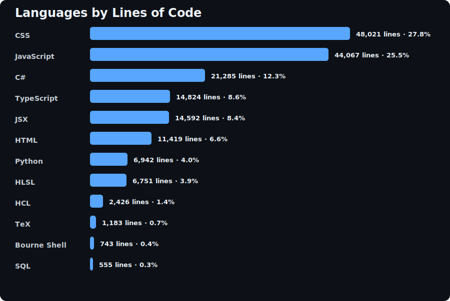
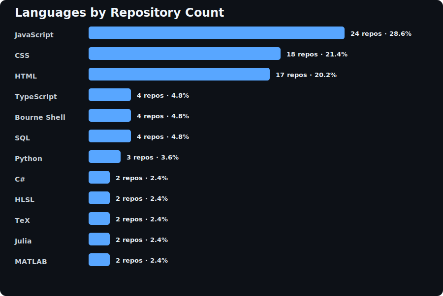

# 👋 Hello, I’m Adam Nuccio

I’m interested in **IT leadership, cloud computing, and software development**.

I’m currently learning **advanced machine learning techniques** and continuing to improve my **web development** skills.

I’m looking to collaborate on:

* Cloud infrastructure solutions
* Machine learning engineering projects
* Data center optimization
* Open-source tooling
* Web applications
* Video game development

## 📊 GitHub Language Stats

### Languages by Lines of Code

### Languages by Repository Count

## 📫 Contact

* LinkedIn: [linkedin.com/in/adam-nuccio](https://www.linkedin.com/in/adam-nuccio/)
* Email: [adam@adamnuccio.com](mailto:adam@adamnuccio.com)

<!---
yahm0/yahm0 is a special repository because its README.md appears on your GitHub profile.
--->
